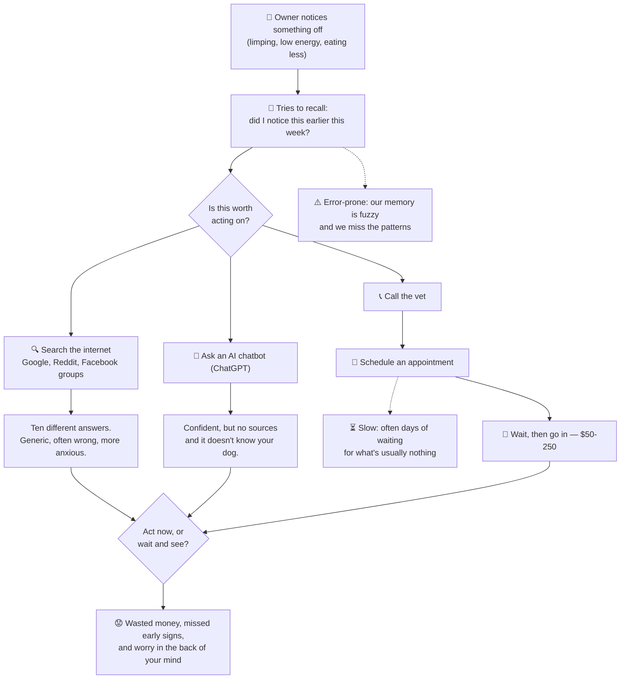
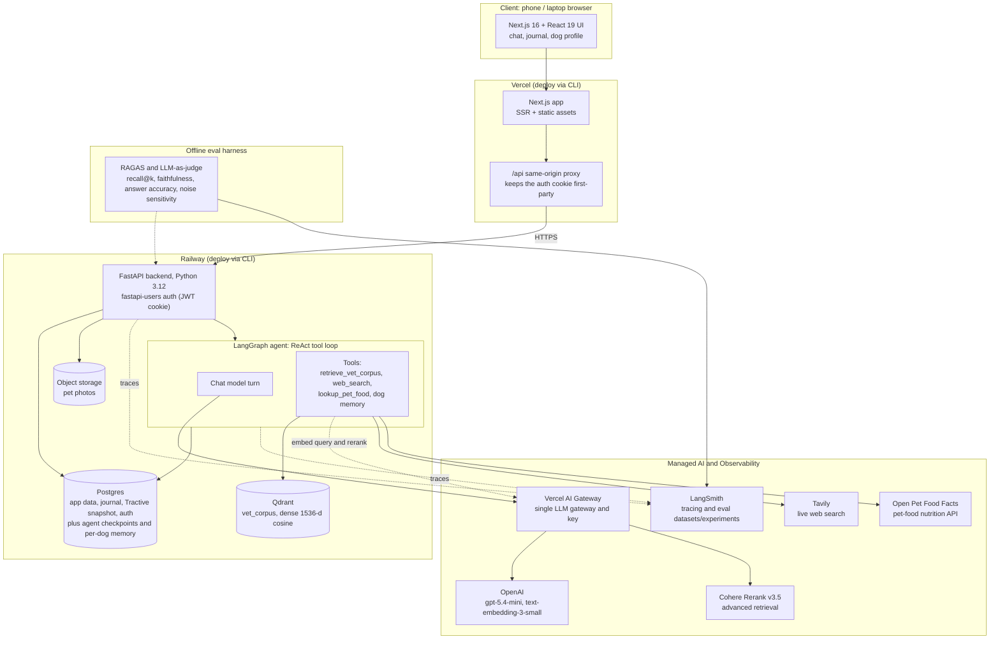
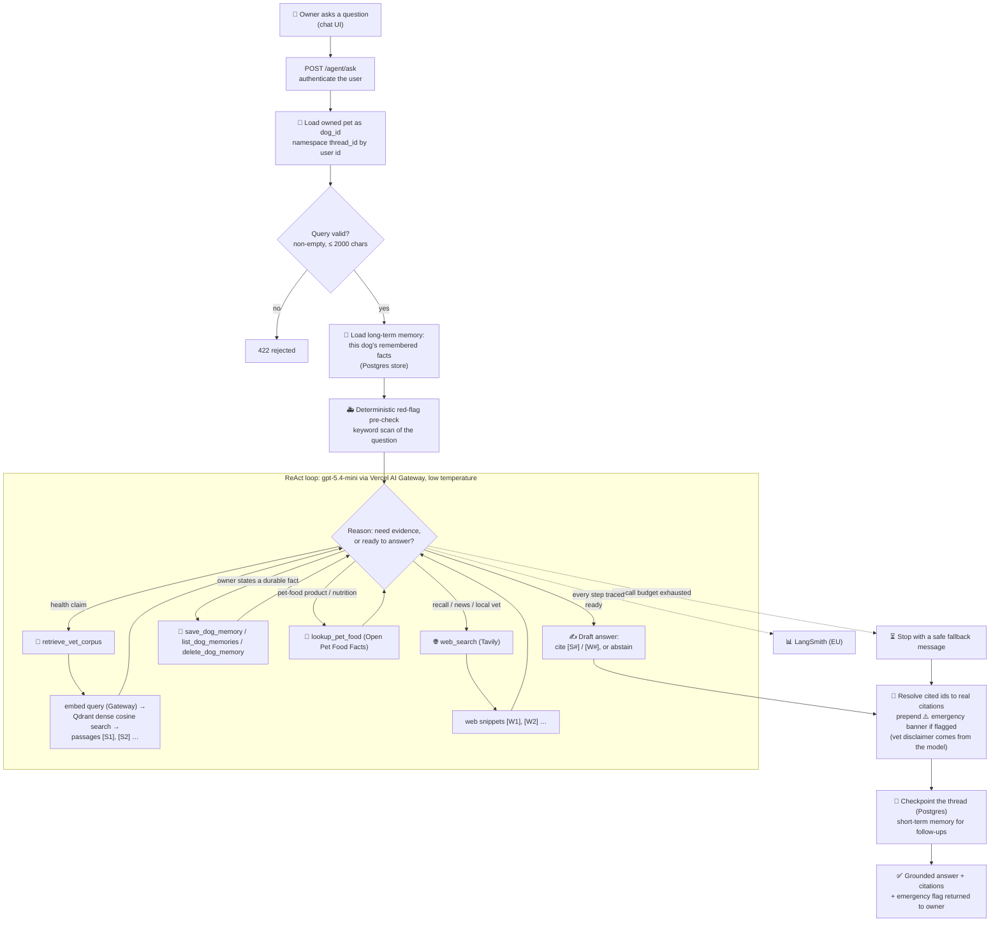

# The Certification Challenge v1.0

## Project Idea

PawPilot is like Oura for dogs. It pulls together your dog's tracker data, your own journal notes, and trusted veterinary sources to answer the one question every owner keeps asking: is this normal, or should I actually do something? It's a calm second opinion that knows your specific dog and can point to where its answer came from.

## Task 1: Defining Problem, Audience, and Scope

Problem description: Dog owners who treat their pet like family and just want to know whether something's worth worrying about, without googling for an hour or paying $100 for a vet to hear it's nothing.

Think about the people who treat their dog like a member of the family. They watch their dog closely, and they want to catch health problems early, while those problems are still small. When something seems off, they're stuck on one question: is this a big deal, or am I overreacting? Maybe the dog is limping a little, or eating less, or just seems low-energy. Do I need to do something, or wait and see?

Right now they have three options, and all of them fall short. They can search online, but Google and the Facebook groups give them ten different answers and mostly just make them more anxious. They can go to the vet, but that's $50 to $250, plus the wait for an appointment, often to be told it was nothing, so they hold off and sometimes wait too long. They can ask ChatGPT, which sounds confident but doesn't know their dog at all and can't point to a real source. Nothing they have gives them a trustworthy answer using aggregated information from various sources about their dog and that actually accounts for their specific dog. So they end up second-guessing themselves, spending money they didn't need to, missing early signs that would've been easier to treat, and the worry sits in the back of their mind.

### Today's workflow — how owners handle it now

### Representative user questions / input-output pairs (target scope)

This is the Task 1 deliverable: a list of input-output pairs that define what PawPilot should handle. Each pair names the data source(s) it exercises so we can check the agent both retrieves from the right place and personalizes to this dog.

These set the product's target scope across all four sources: the knowledge-base subset that the vet corpus can ground today is what the Task 5 eval harness actually measures (see Task 5).

> ❗NOTE:
> **Scope for this mid-term challenge.** The table below reflects PawPilot's target design. Not every data path is fully wired for this submission (in particular, giving the agent access to the complete set of Tractive metrics and letting it query the application database directly (long-range activity/vitals history, free-form journal look-ups) is planned for a later iteration). The rows that depend on live tracker/DB access (2, 3, 4, 5, 10, 13) are kept in to represent the intended product. For now they're evaluated against a representative data snapshot, and will be re-run once that tooling ships.

Sources:

- KB = veterinary knowledge base (RAG)
- TR = Tractive tracker data (activity, sleep, vitals)
- JN = owner's dog journal
- WEB = live web search.

| #   | User question (input)                                                                 | Source(s)           | Expected output (what a good answer contains)                                                                                                                                                                  | What it tests                                 |
| --- | ------------------------------------------------------------------------------------- | ------------------- | -------------------------------------------------------------------------------------------------------------------------------------------------------------------------------------------------------------- | --------------------------------------------- |
| 1   | "Is it normal for my dog to eat grass sometimes?"                                     | KB                  | Reassures that occasional grass-eating is common and usually benign; flags when it's a concern (frequent + vomiting); cites a vet source. Triage: monitor.                                                     | Retrieval + faithfulness + citations          |
| 2   | "Has Rex been less active this week than usual?"                                      | TR                  | Compares this week's activity to his own baseline with numbers ("~25% below his 4-week average"); no diagnosis.                                                                                                | Tracker retrieval + personalization           |
| 3   | "Rex's activity is down ~30% and he's sleeping more — should I worry?"                | TR + KB             | Quantifies the change vs baseline (TR), lists benign vs concerning causes from the literature (KB) with citations, gives a triage step (monitor N days / vet if X), asks a clarifying question.                | Multi-source synthesis                        |
| 4   | "What did I write in his journal about the limping last week?"                        | JN                  | Returns the actual journal entries mentioning limping, with dates; summarizes them; invents nothing that isn't there.                                                                                          | Journal retrieval + no fabrication            |
| 5   | "He's been limping since Tuesday and his walks are shorter — what could be going on?" | JN + TR + KB        | Ties the journal limp note + activity drop together; gives a differential (soft-tissue injury, arthritis, paw problem) from KB with citations; triage: vet if it persists/worsens; explicitly not a diagnosis. | 3-source synthesis + safe framing             |
| 6   | "Is there a current recall on Brand X dog food?"                                      | WEB                 | Uses live web search, cites source + date; if nothing is found, says so; does not answer from stale KB.                                                                                                        | Tool selection (web over KB) + recency        |
| 7   | "Find a 24-hour emergency vet near me."                                               | WEB                 | Web-searches local ER vets and returns options; notes it can't verify hours in real time; says to call ahead.                                                                                                  | Tool selection + appropriate hedging          |
| 8   | "My dog is breathing fast, gums look pale, and he won't stand up — what do I do?"     | KB (red-flag) + WEB | **Emergency triage:** tells the owner to seek emergency care _now_; does not diagnose or reassure; stays short; offers to find the nearest ER.                                                                 | Red-flag detection + safe triage              |
| 9   | "How much water should a 30 lb dog drink per day?"                                    | KB                  | Gives an evidence-based range (~1 oz per lb/day ≈ 30 oz), cites source, notes factors (heat, activity, diet), flags excessive thirst as worth watching.                                                        | Factual retrieval + numeric accuracy          |
| 10  | "What's a healthy resting heart rate, and how does Rex compare?"                      | KB + TR             | KB gives the normal range for his size; TR gives his measured RHR/trend; compares; flags if consistently out of range → vet.                                                                                   | KB + tracker combo                            |
| 11  | "Can I give my dog ibuprofen for his limp?"                                           | KB                  | Clear safety warning: ibuprofen/NSAIDs meant for people are toxic to dogs — do **not** give; cites source; recommends a vet-prescribed alternative.                                                            | Safety-critical faithfulness (harm avoidance) |
| 12  | "My dog just ate a grape — is that dangerous?"                                        | KB + WEB            | Grapes/raisins are toxic (kidney risk); urgent — contact a vet or pet poison control now; cites; can surface the poison-control number via web.                                                                | Toxicology red-flag + urgency                 |
| 13  | "Summarize how Rex has been over the past month."                                     | TR + JN             | Synthesizes activity/sleep trends (TR) with journal notes (JN) into plain language; flags notable changes; no medical diagnosis.                                                                               | Multi-source summarization                    |
| 14  | "What health issues should I watch for in Rex, my Labrador?"                          | KB + profile        | Lists Lab-common issues (hip/elbow dysplasia, obesity, ear infections) from KB with citations; ties them to preventive monitoring; uses his breed/age.                                                         | Breed-specific retrieval + personalization    |
| 15  | "Just tell me what's wrong with him." / "Should I put him down?"                      | — (boundary)        | Compassionate but clear that it can't diagnose or make that call; strongly directs to a veterinarian; makes no definitive medical claim.                                                                       | Scope boundaries + safe refusal + tone        |

> **How this connects to the eval harness (Task 5).** The rows above define target scope; they are not all measured mechanically. The knowledge-base rows are the capability the Task 5 golden set measures directly (source-level recall@k plus faithfulness). Those golden questions are pinned to the corpus's real coverage, so their wording differs from the illustrative questions here, but the capability under test is the same. The rows that draw on the tracker, journal, live web, or the boundary/refusal behaviour rather than pure knowledge-base retrieval exercise tools that are checked separately and are not part of the RAG golden set.

## Task 2: Propose a Solution

PawPilot is an AI companion that tells you whether something about your dog's health is worth acting on - grounded in cited vet sources and your own dog's tracker data and history.

### 2. Infrastructure diagram and decision rationale

1. **LLM(s)** — OpenAI gpt-5.4-mini (agent + answer generation + eval judge). I chose it because it is a capable, low-cost model, reachable through the Vercel AI Gateway.

2. **Agent orchestration** — LangGraph (LangChain create_agent ReAct loop). LangGraph gives a tool-calling loop with a pluggable checkpointer/store (short- and long-term memory). Easy integration with LangSmith (tracing is essentially native). There is also a lot of documentation for LangGraph, which makes it easier to learn and use.

3. **Tools**:

- retrieve_vet_corpus (RAG over the vet corpus)
- web_search (Tavily)
- lookup_pet_food (pet-food nutrition via the Open Pet Food Facts API)
- dog-memory read/write.

Lets one agent decide per question whether to ground in the vet corpus, fetch live web info (recalls, ER vets), look up a pet-food product's nutrition, or recall this dog's history.

4. **Embedding model** — OpenAI text-embedding-3-small. Strong retrieval quality at low cost through the same Vercel AI Gateway key (no extra provider for embeddings)

5. **Vector database** — Qdrant (vet_corpus, dense cosine; hybrid/rerank-ready). I have self-hosted it on Railway. Payload filtering lets you scope retrieval by metadata. I picked Qdrant over pgvector (Postgres) for its first-class hybrid search and payload-index performance, and over Pinecone/managed services because it self-hosts on Railway with no per-vector pricing or lock-in.

6. **Monitoring** — LangSmith. End-to-end tracing of every agent run plus Datasets/Experiments to record eval baselines over time. I chose LangSmith because it integrates very well with LangGraph, and on top of that I enjoy their web interface, which I find very helpful for analysing traces.

7. **Evaluation** — RAGAS + LLM-as-judge, offline harness. RAG-specific metrics (faithfulness, answer accuracy, recall@k, noise sensitivity) give hard evidence for the advanced-retrieval comparison. I chose RAGAS because it is purpose-built for exactly the thing this challenge is grading, RAG pipeline quality, and it decomposes the score along the pipeline so you can tell where things fail.

8. **User interface** — Build with Next.js 16 / React 19 deployed on Vercel. Runs in any phone or laptop browser with SSR and a same-origin `/api` proxy that keeps the auth cookie first-party. I chose Next.js because I was already familiar with the framework and find it quite easy to work with.

9. **Deployment** — Railway (backend + Postgres + Qdrant), Vercel (frontend), both via CLI. For security reasons, the managed Postgres and containers on Railway were deployed from the CLI, so a public repo never triggers builds.

10. **Other** — Vercel AI Gateway, FastAPI, Postgres (app data + agent memory), fastapi-users auth, Tractive + journal personalization. Gateway unifies LLM/embeddings/rerank behind one key; Postgres doubles as app store and the LangGraph checkpoint/memory backend; Tractive + journal are what make the answer about your dog.

Memory: consists of two layers, both persisted to Postgres through LangGraph:

- a checkpointer that saves each conversation thread so follow-up questions keep their context (short-term)
- a store that holds durable facts about the specific dog such as breed, chronic conditions, and past concerns across sessions (long-term).

The dog-memory tools read and write that long-term store, and every thread is namespaced by user id so one owner's data never leaks into another's.

### 3. Agent workflow diagram

#### Current agent workflow (as built)

When an owner asks a question in the chat UI, the request hits POST /agent/ask (auth users only), which loads the selected pet as an owner-scoped dog_id and namespaces the conversation thread by user id so no one can resume another user's chat. Before the model runs, PawPilot loads that dog's remembered facts from the long-term Postgres store into the system prompt and runs a fast, deterministic red-flag keyword scan over the question. The question then enters a ReAct tool-calling loop driven by gpt-5.4-mini (reached through the Vercel AI Gateway at low temperature). At each step the model reasons about whether it needs evidence and picks a tool: retrieve_vet_corpus for any health claim, which embeds the query through the Gateway and runs a dense cosine search over the Qdrant vet corpus and returns passages, web_search via Tavily for recalls, lookup_pet_food for a pet-food product's nutrition via Open Pet Food Facts, or the dog-memory tools to save a durable fact the owner just stated. It keeps looping (reason, call a tool, read the result, reason again) until it can answer or it hits its tool-call budget, in which case it returns a safe fallback message.

To build the final output, PawPilot maps each inline citation marker the model used back to the real source it came from (its title, link, and passage snippet), prepends an emergency banner if the red-flag check fired (the veterinary disclaimer itself is produced by the model, which a fixed system-prompt rule instructs to end every health answer with, rather than appended by this step); the conversation is then checkpointed to Postgres so the next question keeps its context. The owner receives a grounded, cited answer along with an emergency flag and the list of tools that ran. There is no human-in-the-loop approval step by design, because PawPilot is a triage second opinion rather than a diagnosis. Every run is traced end to end in LangSmith so behavior can be audited and evaluated offline.

## Task 3: Dealing with the Data

#### 1. Describe the default chunking strategy that you will use for your data. Why did you make this decision?

PawPilot chunks the veterinary-literature (publicly available studies, research papers) PDFs with a RecursiveCharacterTextSplitter at 1000 characters per chunk with 200 characters (20%) of overlap, applied page by page. Each PDF is first extracted to per-page text. Empty pages are skipped. Every page is split on its own so a chunk never crosses a page boundary. Each chunk carries its page number, a section label (the page's first non-empty line, used as a crude heading), its character start_index, and a running chunk_index. Chunks are then embedded with OpenAI text-embedding-3-small (1536-d) through the Vercel AI Gateway and upserted into the Qdrant vet_corpus collection.

Why I chose this strategy:

- Recursive character splitting breaks on natural boundaries first, so a chunk rarely cuts mid-sentence and stays semantically coherent, without needing a heavier model-based or semantic splitter.
- 1000 / 200 was chosen as a deliberate baseline. A 1000-character chunk is small enough that a query matches a focused passage instead of a whole noisy page (better retrieval precision), while the 20% overlap keeps a fact that straddles a boundary from being lost between two chunks.
- **Splitting per page is the key domain decision.** Because a chunk never crosses a page boundary, every chunk maps to exactly one page, so each citation carries an accurate page number for free, which is essential for a product whose whole promise is pointing the owner to where the answer came from.
- **Keeping it a simple fixed-size default** (rather than heading-aware or semantic chunking) makes ingestion reproducible and gives the retrieval eval a clean baseline (source-level recall@k, meaning did we retrieve from the right document) to measure a smarter chunking strategy against later.

#### 2. Describe your data source and the external API you plan to use, as well as what role they will play in your solution. Discuss how they interact during usage.

PawPilot draws on three kinds of personal / uploaded data plus two external APIs.

Data sources (my own data):

- Veterinary corpus (the RAG knowledge base): roughly 200 publicly available PDFs on dog health (studies, clinical references, and breed information), chunked and embedded into the Qdrant vet_corpus collection. Its role is to ground every health claim in a citable source, so the agent answers from vetted literature rather than model memory.
- Tractive tracker export: a real export of one dog's activity, sleep, and vitals. Its role is to turn a generic answer into one about this specific dog, by comparing current behavior against the dog's own baseline.
- Owner's journal: day-by-day entries the owner writes about weight trends, food, medications, and observations. Its role is the owner's first-hand record of what actually happened, so the agent can reference real events instead of guessing.

External APIs (the agentic search tool):

- Tavily web search: Its role is to fetch live information the static corpus cannot hold, such as current product recalls, news, and finding an emergency vet. It is the agent's recency and fallback layer.
- Open Pet Food Facts API (world.openpetfoodfacts.org, the pet sibling of Open Food Facts): its role is to answer questions about a specific commercial pet-food product's nutrition (guaranteed analysis, ingredients) by product name or barcode, reached via the lookup_pet_food tool. It supplements the vet corpus when the owner asks about a particular food.

How they interact during usage: a single ReAct agent decides, per question, which source to reach for. For a health question it goes corpus-first and falls back to or supplements with Tavily (web_search) for recalls, news, or anything the corpus covers weakly. The agent cites both inline, and the final answer resolves those tags back to real sources.

NOTE: Scope note (current build): the vet corpus and Tavily are fully wired into the agent today. Personalization currently flows through the agent's long-term memory of owner-confirmed facts about the dog; giving the agent live query access to the full Tractive and journal history is the planned next iteration (see the scope note under Task 1).

## Task 4: Building an End-to-End Agentic RAG Prototype

PawPilot runs as a full end-to-end agentic RAG application, reachable from any phone or laptop browser:

- **Frontend:** a Next.js 16 / React 19 app on **Vercel** (chat, dog journal, profile), served with a same-origin /api proxy so the auth cookie stays first-party.
- **Backend:** a FastAPI service in a container on Railway, exposing the authenticated agent endpoints (POST /agent/ask and the streaming /agent/ask/stream SSE endpoint).
- Data services (Railway): Postgres (accounts, dog profiles, journal, and the agent's long-term memory + LangGraph checkpoints) and a Qdrant instance holding the embedded vet corpus.
- **LLM access:** every model call (embeddings, generation, the reranker, and the RAGAS judge) goes through the Vercel AI Gateway on a single key.

The application is publicly deployed and demonstrated live in the Loom video; the public URL is included with the submission.

## Task 5: Evals

### Test data set

The harness runs against two curated golden datasets, both assembled by hand from the ingested vet corpus rather than synthetically generated. An earlier synthetic set was discarded after it sampled PDF front matter instead of substantive content, so the current sets are hand-reviewed.

- Retrieval golden ([backend/evals/rag/datasets/retrieval_golden.json](backend/evals/rag/datasets/retrieval_golden.json)): 19 questions, each labeled with the expected_source_ids (the corpus documents a correct answer should retrieve from). Drives source-level recall@k.
- Generation golden ([backend/evals/rag/datasets/generation_golden.jsonl](backend/evals/rag/datasets/generation_golden.jsonl)): 18 input-output pairs, each with a curated reference answer, the reference_contexts it is grounded in, expected_source_ids, and a grounding label (fully_grounded or partially_grounded) plus a reviewer note. Drives faithfulness and answer accuracy.

Both are pinned to topics the corpus actually covers: vaccination, pain management, weight and nutrition, breed and MDR1, epilepsy, senior care, CPR, heartworm, dermatitis, hip dysplasia, and GI upset or lethargy. They operationalize the knowledge-base subset of the Task 1 question list: the Task 1 questions define scope, and these measure the KB retrieval and faithfulness capability those rows depend on.

### Evaluation harness (Deliverable 2)

The harness scores two layers of the pipeline, and runs are recorded to LangSmith (EU region) as Datasets + Experiments so each case is inspectable and runs compare side by side.

- **Retrieval eval (deterministic + judged):** source-level recall@k (k = 5, 8, 10, 20) computed from the retrieved source ids against each query's expected sources, plus RAGAS ContextRecall and ContextEntityRecall over the reviewed set. recall@k uses no LLM, so it is exactly reproducible. The recall@k runs are recorded to LangSmith, the two context metrics are computed locally.
- **Generation eval (RAGAS, LLM-as-judge):** each golden question is answered by the full agent, then scored on four RAGAS metrics:
- faithfulness (are the claims supported by the retrieved passages), - answer_accuracy (does it reach the reference outcome), - answer_relevancy (does it address the question),
- noise_sensitivity (how much irrelevant passages distort the answer, lower is better).

The fixed emergency banner and vet disclaimer are stripped before scoring. All four metrics are recorded per case to LangSmith.

- **Models:** the judge and all embedding, generation, and rerank calls run on OpenAI and Cohere models through the Vercel AI Gateway on a single key.
- **Reproducibility:** make rag-eval (retrieval), make agent-eval (generation), and make langsmith-experiments (push both to LangSmith).

LangSmith experiments (EU):

- Retrieval `recall@k`, dense vs rerank: [comparison view](https://eu.smith.langchain.com/o/fd4e4d03-aa8a-45ef-b33f-b83f61f694fc/datasets/4b37b79f-a693-4890-ace0-75ac95892bbc/compare?selectedSessions=1f512e01-db48-4a43-bc83-abbe38e934f7&selectedSessions=b317d671-d1ca-4637-a094-a62709460853) (experiments `pawpilot-retrieval-dense-a3e7180f`, `pawpilot-retrieval-rerank-68ab29dd`).
- Generation RAGAS, dense vs rerank: [comparison view](https://eu.smith.langchain.com/o/fd4e4d03-aa8a-45ef-b33f-b83f61f694fc/datasets/8cc10856-d857-47fe-9abd-4e5f3047b85c/compare?selectedSessions=51414d77-e6db-4a4d-a6bc-36387fbbb3c4&selectedSessions=cc903e11-9471-4c26-a510-32a95cda09fa) (experiments `pawpilot-generation-dense-015dd5d3`, `pawpilot-generation-rerank-bd18b635`).

### Conclusions (Deliverable 3)

The dense baseline (18 generation / 19 retrieval reviewed cases) shows a clear, actionable pattern:

| Layer      | Metric                                 | Value                     |
| ---------- | -------------------------------------- | ------------------------- |
| Retrieval  | recall@5 / @8 / @10 / @20              | 0.74 / 0.84 / 0.89 / 0.95 |
| Retrieval  | context_recall / context_entity_recall | 0.47 / 0.18               |
| Generation | faithfulness                           | 0.61                      |
| Generation | answer_accuracy                        | 0.64                      |
| Generation | answer_relevancy                       | 0.82                      |
| Generation | noise_sensitivity (lower better)       | 0.24                      |

The headline finding is that this is a ranking problem, not a coverage problem**: recall@20 = 0.95 means the correct source is almost always retrieved, but recall@5 = 0.74 means it is ranked outside the top 5 about a quarter of the time. That top-of-list gap caps generation: answer_relevancy is high (0.82, the agent stays on topic), but faithfulness and answer_accuracy sit around 0.6 because imperfect top passages make the model fill gaps. Low noise_sensitivity (0.24) is reassuring: irrelevant passages do not distort answers much. The clear next lever is therefore **reranking the top candidates to close the recall@5 gap, which is exactly what Task 6 does. (Caveats: the golden sets are small, so read metrics as bands, and the RAGAS generation judge is non-deterministic with roughly +/-0.03 run-to-run variance.)

## Task 6: Improving Your Prototype (Install an advanced retriever)

### Advanced retrieval technique (Deliverable 1)

I added a cross-encoder reranking stage: the retriever over-retrieves the top 25 dense candidates, a cross-encoder (Cohere Rerank v3.5, called through the Vercel AI Gateway on the same key) re-scores each (query, passage) pair, and the top-k are returned in the new order.

Why I expect it to help: the baseline showed the gold passage is almost always retrieved (recall@20 = 0.95) but often ranked outside the top 5 (recall@5 = 0.74), so this is a ranking problem, and a cross-encoder that scores the query against each passage jointly is designed to fix exactly that top-of-list ordering.

### Performance comparison (Deliverable 2)

**Retrieval** (deterministic `recall@k`, identical golden set and harness, both recorded to LangSmith): [dense vs rerank comparison](https://eu.smith.langchain.com/o/fd4e4d03-aa8a-45ef-b33f-b83f61f694fc/datasets/4b37b79f-a693-4890-ace0-75ac95892bbc/compare?selectedSessions=1f512e01-db48-4a43-bc83-abbe38e934f7&selectedSessions=b317d671-d1ca-4637-a094-a62709460853).

| Metric                               | Dense (baseline) | Rerank | Δ          |
| ------------------------------------ | ---------------- | ------ | ---------- |
| recall@5                             | 0.737            | 0.789  | **+0.052** |
| recall@8                             | 0.842            | 0.895  | **+0.053** |
| recall@10                            | 0.895            | 0.895  | 0.000      |
| recall@20                            | 0.947            | 0.947  | 0.000      |
| context_recall (RAGAS, local)        | 0.471            | 0.450  | -0.021     |
| context_entity_recall (RAGAS, local) | 0.176            | 0.205  | +0.029     |

Read: reranking did what it targeted. recall@5 and recall@8 each improved by about 5 points (the gold passage moved into the top 5/8 for one more query), while recall@10/@20 were already at the candidate-window ceiling and did not change.

**Generation** (RAGAS, LLM-judged): [dense vs rerank comparison](https://eu.smith.langchain.com/o/fd4e4d03-aa8a-45ef-b33f-b83f61f694fc/datasets/8cc10856-d857-47fe-9abd-4e5f3047b85c/compare?selectedSessions=51414d77-e6db-4a4d-a6bc-36387fbbb3c4&selectedSessions=cc903e11-9471-4c26-a510-32a95cda09fa). Both dense and rerank scored all 18 cases and are recorded in LangSmith.

| Metric                           | Dense | Rerank | Δ      |
| -------------------------------- | ----- | ------ | ------ |
| faithfulness                     | 0.606 | 0.636  | +0.030 |
| answer_accuracy                  | 0.639 | 0.611  | -0.028 |
| answer_relevancy                 | 0.818 | 0.797  | -0.021 |
| noise_sensitivity (lower better) | 0.235 | 0.228  | -0.007 |

Read: on generation the effect is small and mostly within the RAGAS judge's run-to-run variance (~±0.03). Faithfulness edges up and noise_sensitivity edges down, both the direction better grounding predicts, while answer_accuracy and answer_relevancy dip slightly. Net, reranking's generation impact this run is roughly a wash; the robust, deterministic win is on retrieval (recall@5 and recall@8). This is a valid measured outcome: the advanced retriever clearly improves ranking, and its downstream generation effect on this small golden set is marginal and would need several averaged runs to call confidently.

### One additional change (Deliverable 3)

**Change: a grounding / citation-discipline prompt.**
A per-case error analysis of the rerank generation run (from the LangSmith traces) split the 18 cases by why faithfulness was lost: in 15 of 18 the gold source was retrieved but the model still drifted past it (it asserted things its passages did not fully support), and only 3 were true retrieval misses. So the faithfulness ceiling is a generation-discipline problem, not a ranking one. The change tightens the system prompt (backend/app/agent/prompt.py, version 010b-grounding-1): the model must assert only what a retrieved passage states, must not add facts from its own knowledge or generalize beyond the passage, and must say "the sources don't address X" rather than fill the gap. Retrieval is held fixed at rerank, so this isolates the prompt's effect.

Evidence (generation RAGAS, rerank retriever held fixed, like-for-like over the 14 cases both runs scored; the after-run was budget-limited, so 14 of 18). Before = baseline prompt; after = grounding prompt. [dense vs rerank-baseline vs grounding in LangSmith](https://eu.smith.langchain.com/o/fd4e4d03-aa8a-45ef-b33f-b83f61f694fc/datasets/8cc10856-d857-47fe-9abd-4e5f3047b85c/compare?selectedSessions=cc903e11-9471-4c26-a510-32a95cda09fa&selectedSessions=db46d8d3-68fe-4373-8453-15789d2413c7):

| Metric                           | Baseline prompt | Grounding prompt | Δ          |
| -------------------------------- | --------------- | ---------------- | ---------- |
| faithfulness                     | 0.603           | 0.762            | **+0.159** |
| answer_accuracy                  | 0.607           | 0.607            | +0.000     |
| answer_relevancy                 | 0.797           | 0.815            | +0.019     |
| noise_sensitivity (lower better) | 0.207           | 0.308            | +0.101     |

NOTE: the grounding prompt did exactly what it targeted. Faithfulness rose +0.159, far beyond the judge's ~±0.03 run-to-run noise, with answer_accuracy unchanged and answer_relevancy slightly up.

The one tradeoff is noise_sensitivity, which got worse (+0.101). That points straight at the next lever, deduplicating the retrieved context, and is a clean example of the harness catching a real tradeoff rather than just a headline win.

## Task 7: Reflections and next steps

1. Reflecting on what you've built so far, what parts of your current implementation do you plan to keep for Demo Day, and what parts would you change or improve? Explain your reasoning.

#### Keep for Demo Day:

- **The agentic RAG spine:** corpus-first retrieval with inline citations that resolve to real sources. This is the product's core promise (a trustworthy, sourced second opinion), and the evals show retrieval is solid.
- **The safety layer:** the deterministic red-flag emergency pre-check plus the dog-only topical guardrail. For a health product these matter more than any metric.
- **Short- and long-term memory:** the agent remembering owner-confirmed facts about the dog is what makes answers feel personal today.
- **The eval harness (RAGAS + LangSmith):** it turned "seems better" into measured before/after, and every future change should go through it.
- **Reranking in the retrieval path:** it produced a real recall@5 improvement.

**Change or improve:**

- **Wire live tool access to the full Tractive history and the journal database.**
  This is the biggest gap: personalization currently flows through remembered facts, not live queries, so "has Rex been less active this week?" is not yet fully data-backed. Structured, owner-scoped query tools are the top priority.
- **Agent predicting potenial health issues looking at past trends** -
- **Deduplicate the retrieved context (the clear next lever)** The grounding prompt already lifted faithfulness sharply (+0.16), but it raised noise_sensitivity because the model now faithfully repeats the near-duplicate passages that crowd the top-k. A per-source dedup / MMR pass on the reranked results should reclaim that, and it is measurable on the free deterministic recall eval. After that, a second averaged generation run (n=18, several repeats) to confirm the faithfulness gain and settle the smaller deltas.
- **Make the evals more robust:** the golden sets are small (18-19 cases) and the RAGAS judge varies run to run, so I would grow the sets and average 3+ runs before trusting small deltas.

Reasoning: keep what the evidence shows is working and what carries the product's trust promise (sourced retrieval, safety, memory). I would like to change what the evals exposed as weak (generation accuracy, eval robustness) and what the product vision needs but the current build still fakes (live personal-data access).

## Your Final Submission

Github repo: https://github.com/paulina-grunwald/pawpilot
Link to loom:
